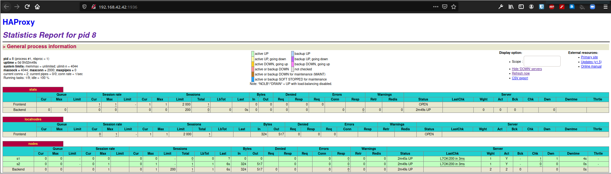

# Lab 04 - Docker

# Authors : Jeremy Zerbib, Adrien Barth

## Link forked from [here](https://github.com/SoftEng-HEIGVD/Teaching-HEIGVD-AIT-2019-Labo-Docker) and the version is `28e97b713e2d3803acee5b447dd67596624e11b0`

## Introduction

As an introduction, we can say that the goals of this lab are to build our own `Docker` images, become familiar with process supervision for `Docker`, understand core concepts for dynamic scaling of an application in production and put into practice decentralised management of web server instances. This lab is built upon the previous lab we did on the load-balancing tool `HAProxy`.

In order to attain all the objectives of the lab, we will have to perform 7 tasks, including an introductory task to install and get familiar with the tools  

## Task 0 : Identify issues and install the tools

### Questions

#### **[M1]** Do you think we can use the current solution for a production environment? What are the main problems when deploying it in a production environment?

This solution is not usable in a production environment because it can cause some loss of session depending on the cookie used. 

Based on our configuration of the previous lab, we used `SERVERID` cookies so those unpredictable crashes could be a cause of loss of sessions. While the server is online, the user can navigate on the website and keep his session. But if the connection is lost and we reload the container, the `id` might not be the same and therefore the session is lost. 

Another issue is the latency between the human reaction and the server being down. The fact that the administrator has to perform a check on the servers to kill one and reload it has to create some latency. Therefore, a user could lose his connection 

#### **[M2]** Describe what you need to do to add new `webapp` container to the infrastructure. Give the exact steps of what you have to do without modifiying the way the things are done. Hint: You probably have to modify some configuration and script files in a Docker image.

#### **[M3]** Based on your previous answers, you have detected some issues in the current solution. Now propose a better approach at a high level.

#### **[M4]** You probably noticed that the list of web application nodes is hardcoded in the load balancer configuration. How can we manage the web app nodes in a more dynamic fashion?

#### **[M5]** In the physical or virtual machines of a typical infrastructure we tend to have not only one main process (like the web server or the load balancer) running, but a few additional processes on the side to perform management tasks.

#### For example to monitor the distributed system as a whole it is common to collect in one centralised place all the logs produced by the different machines. Therefore we need a process running on each machine that will forward the logs to the central place. (We could also imagine a central tool that reaches out to each machine to gather the logs. That's a push vs. pull problem.) It is quite common to see a push mechanism used for this kind of task. 

#### Do you think our current solution is able to run additional management processes beside the main web server / load balancer process in a container? If no, what is missing / required to reach the goal? If yes, how to proceed to run for example a log forwarding process?

#### **[M6]** In our current solution, although the load balancer configuration is changing dynamically, it doesn't follow dynamically the configuration of our distributed system when web servers are added or removed. If we take a closer look at the `run.sh` script, we see two calls to `sed` which will replace two lines in the `haproxy.cfg` configuration file just before we start `haproxy`. You clearly see that the configuration file has two lines and the script will replace these two lines.

#### What happens if we add more web server nodes? Do you think it is really dynamic? It's far away from being a dynamic configuration. Can you propose a solution to solve this?

### Deliverable

#### Take a screenshot of the stats page of HAProxy at http://192.168.42.42:1936. You should see your backend nodes.

#### Give the URL of your repository URL in the lab report.

The URL of our repository is this [one](https://github.com/jerozerbib/Teaching-HEIGVD-AIT-2019-Labo-Docker). 

## Task 1 :  Add a process supervisor to run several processes

### Question 1 : Take a screenshot of the stats page of HAProxy at http://192.168.42.42:1936. You should see your backend nodes. It should be really similar to the screenshot of the previous task.

### Question 2 : Describe your difficulties for this task and your understanding of what is happening during this task. Explain in your own words why are we installing a process supervisor. Do not hesitate to do more research and to find more articles on that topic to illustrate the problem.

We did not encounter many difficulties in this part (except the fact that the path were bloated a bit but no big deal). Everything ran smoothly and we did not spend a lot of time doing the manipulations.

As for the installation of a  *process supervisor*, we found that it would be useful in order to run multiple processes in the same `Docker` *container*. As it was stated in the documentation of the lab, `Docker` is made to run a single process by *container*. If we want to bypass the single process implementation, we have to start a little process, `init` in our case, that runs as our main process and start other secondaries processes as the multiple processes we need. From there, we set up `S6` to manage our processes. At the end, we can see that the `init` process start the `Docker` configuration and `S6` will manage the other applications processes. 

## Task 2 :  Add a tool to manage membership in the web server cluster

### Deliverable 1 : Provide the docker log output for each of the containers: `ha`, `s1` and `s2`. You need to create a folder `logs` in your repository to store the files separately from the lab report. For each lab task create a folder and name it using the task number. No need to create a folder when there are no logs

Check [Task 2](../logs/task_2)

### Deliverable 2 : Give the answer to the question about the existing problem the with the current solution.

The existing problem with the current solution is that we create a *cluster* around `ha` asking the new nodes to join this one first. The problem lies in the fact that if the cluster does not exist while we create a new *node*, it will not work. What we would have wanted to do is that all the new nodes that we create can join the cluster independently of the other nodes.

### Deliverable 3 : Give an explanation on how `Serf` is working. Read the official website to get more details about the `GOSSIP` protocol used in `Serf`. Try to find other solutions that can be used to solve similar situations where we need some auto-discovery mechanism.

`Serf is a decentralized solution for service discovery and orchestration that is lightweight, highly available, and fault tolerant.` 

This quote [`Serf's github page`](https://github.com/hashicorp/serf) means that `Serf` is a discovery service that allows to detect nodes failures and notify the rest of the cluster. *"An event system is built on top of Serf, letting you use Serf's gossip protocol to propagate events such as deploys, configuration changes, etc. Serf is completely masterless with no single point of failure."* 

A `GOSSIP protocol` is a process of computer peer-to-peer communication based on the spread on an epidemics.  

In `Serf`'s case, it means that the nodes will be kept updated about the health and the status of the other nodes. It works in a bidirectional communication between the current node and the cluster. That way, new nodes can join the cluster at any time and their health will be checked on by the other nodes.

As seen [here](https://sysadmin.libhunt.com/serf-alternatives), we can see that a lot of alternatives exist. The most significant would be `kubernetes` or `consul`. 