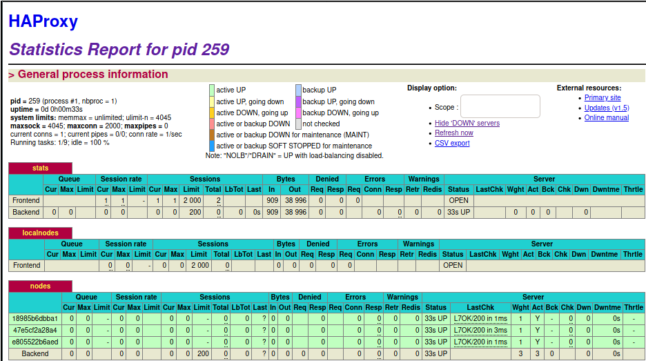
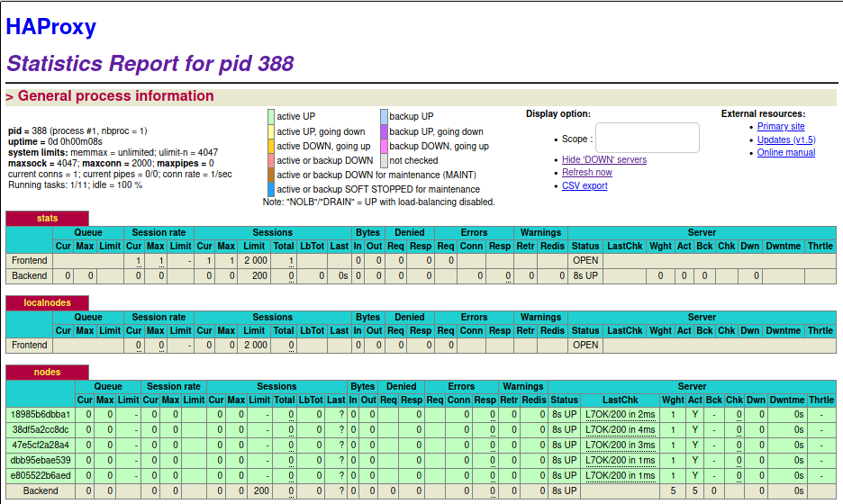
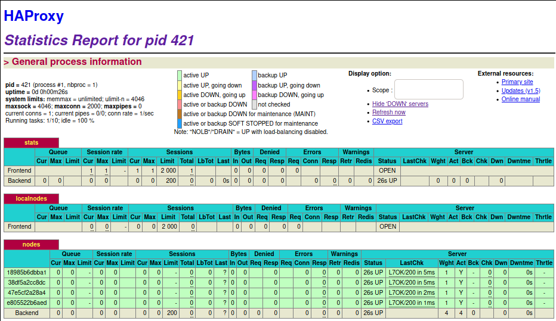

# Lab 04 - Docker

# Authors : Jeremy Zerbib, Adrien Barth

## Link forked from [here](https://github.com/SoftEng-HEIGVD/Teaching-HEIGVD-AIT-2019-Labo-Docker) and the version is `28e97b713e2d3803acee5b447dd67596624e11b0`

## Introduction

As an introduction, we can say that the goals of this lab are to build our own `Docker` images, become familiar with process supervision for `Docker`, understand core concepts for dynamic scaling of an application in production and put into practice decentralised management of web server instances. This lab is built upon the previous lab we did on the load-balancing tool `HAProxy`.

The lab consists of 6 tasks and one initial task (the initial task should be quick if you already completed the lab on load balancing):

1. [Add a process supervisor to run several processes](#Task 1 :  Add a process supervisor to run several processes)
2. [Add a tool to manage membership in the web server cluster](#Task 2 :  Add a tool to manage membership in the web server cluster)
3. [React to membership changes](#Task 3 : React to membership changes)
4. [Use a template engine to easily generate configuration files](#Task 4 : Use a template engine to easily generate configuration files)
5. [Generate a new load balancer configuration when membership changes](#Task 5 : Generate a new load balancer configuration when membership changes)
6. [Make the load balancer automatically reload the new configuration](#Task 6: Make the load balancer automatically reload the new configuration)

The introduction task is : [Identify issues and install the tools](#Task 0 : Identify issues and install the tools)

## Task 0 : Identify issues and install the tools

### Questions

#### **[M1]** Do you think we can use the current solution for a production environment? What are the main problems when deploying it in a production environment?

An issue is the latency between the human reaction and the server being down. The fact that the administrator has to perform a check on the servers to kill one and reload it has to create some latency. In the previous lab, we built an architecture that was working fine, but we add to configure the proxy and reload it manually each time. This implies some heavy human interaction and therefore create some latency.

Furthermore, in our previous implementation of the lab, we used the `SERVERID` cookie session management. In this implementation, such bugs could cause some session losses and therefore, create some inconveniences.

#### **[M2]** Describe what you need to do to add new `webapp` container to the infrastructure. Give the exact steps of what you have to do without modifying the way the things are done. Hint: You probably have to modify some configuration and script files in a Docker image.

In order to add a new node in our webapp, you need to : 

1. Add the server in the [haconfig](../ha/config/haproxy.cfg), by adding the line `server s3 <s3>:3000 check` after the *s2* server is declared.

2. Add the following line in the `run` script in the `ha/scripts` folder. 

   ```bash
   sed -i 's/<s3>/$S3_PORT_3000_TCP_ADDR/g' /usr/local/etc/haproxy/haproxy.cfg
   ```

3. In the [docker-compose](../docker-compose.yml) file, add the following under the *s2* declaration : 

   ```dockerfile
   webapp3:
           container_name: ${WEBAPP_3_NAME}
           build:
             context: ./webapp
             dockerfile: Dockerfile
           networks:
             heig:
               ipv4_address: ${WEBAPP_3_IP}
           ports:
             - "4001:3000"
           environment:
                - TAG=${WEBAPP_3_NAME}
                - SERVER_IP=${WEBAPP_3_IP}
   ```

4. Run in the root  folder `docker-compose up --build`.

Note that based on the version you take, you will not be able to do those changes because our repository has changed a lot after some steps of the lab. If you want to take a version that works go on the commit number [`835edb1a3e`](https://github.com/jerozerbib/Teaching-HEIGVD-AIT-2019-Labo-Docker/tree/835edb1a3e6406011029e3e1af12fd566f7639fe).

#### **[M3]** Based on your previous answers, you have detected some issues in the current solution. Now propose a better approach at a high level.

In our solution. we have to add and configure each new node manually. This could be sometimes lengthy and painful to do so. Therefore, a new approach more dynamic could be more than welcome in order to make adding a node faster.

#### **[M4]** You probably noticed that the list of web application nodes is hardcoded in the load balancer configuration. How can we manage the web app nodes in a more dynamic fashion?

You could create a script that adds to the configuration file the name of the node and the info needed dynamically. `HaProxy` offers a *runtime API*  that allows us to do so. A more detailed solution could be found [here](https://www.haproxy.com/blog/dynamic-scaling-for-microservices-with-runtime-api/).

#### **[M5]** In the physical or virtual machines of a typical infrastructure we tend to have not only one main process (like the web server or the load balancer) running, but a few additional processes on the side to perform management tasks.

#### For example to monitor the distributed system as a whole it is common to collect in one centralised place all the logs produced by the different machines. Therefore we need a process running on each machine that will forward the logs to the central place. (We could also imagine a central tool that reaches out to each machine to gather the logs. That's a push vs. pull problem.) It is quite common to see a push mechanism used for this kind of task. 

#### Do you think our current solution is able to run additional management processes beside the main web server / load balancer process in a container? If no, what is missing / required to reach the goal? If yes, how to proceed to run for example a log forwarding process?

Our solution does not allow multiple processes to be launched on the same `Docker` as it goes against the good behaviour of using a `Docker` image. A way to bypass those barriers is to create a launcher process (`ìnit`) and launch sub-processes. 

Looking at the [run](../ha/scripts/run.sh) (on the right commit version right otherwise the link does not work) , we can see that we use `rsyslogd`. We could use this command to log everything we need and forward them to a centralised server.

Another solution would be to use the log Docker's mechanism of logging and send them to a server. 

#### **[M6]** In our current solution, although the load balancer configuration is changing dynamically, it doesn't follow dynamically the configuration of our distributed system when web servers are added or removed. If we take a closer look at the `run.sh` script, we see two calls to `sed` which will replace two lines in the `haproxy.cfg` configuration file just before we start `haproxy`. You clearly see that the configuration file has two lines and the script will replace these two lines.

#### What happens if we add more web server nodes? Do you think it is really dynamic? It's far away from being a dynamic configuration. Can you propose a solution to solve this?

Whenever we want to add a new node to the node to the configuration file of *HaProxy* and relaunch the script in order to get the changes to stick. One way to patch this issue would the `Runtime API` of *HaProxy* and find some kind of solution to patch the problem we created.

### Deliverable

#### Take a screenshot of the stats page of HAProxy at http://192.168.42.42:1936. You should see your backend nodes.


Here we have only two nodes as we did not apply the modifications on the DockerFile nor the scripts presented above. We did not see fit to do so.

#### Give the URL of your repository URL in the lab report.

The URL of our repository is this [one](https://github.com/jerozerbib/Teaching-HEIGVD-AIT-2019-Labo-Docker). 

## Task 1 :  Add a process supervisor to run several processes

### Question 1 : Take a screenshot of the stats page of HAProxy at http://192.168.42.42:1936. You should see your backend nodes. It should be really similar to the screenshot of the previous task.


### Question 2 : Describe your difficulties for this task and your understanding of what is happening during this task. Explain in your own words why are we installing a process supervisor. Do not hesitate to do more research and to find more articles on that topic to illustrate the problem.

We did not encounter many difficulties in this part (except the fact that the path were bloated a bit but no big deal). Everything ran smoothly and we did not spend a lot of time doing the manipulations.

As for the installation of a  *process supervisor*, we found that it would be useful in order to run multiple processes in the same `Docker` *container*. As it was stated in the documentation of the lab, `Docker` is made to run a single process by *container*. If we want to bypass the single process implementation, we have to start a little process, `init` in our case, that runs as our main process and start other secondaries processes as the multiple processes we need. From there, we set up `S6` to manage our processes. At the end, we can see that the `init` process start the `Docker` configuration and `S6` will manage the other applications processes. 

## Task 2 :  Add a tool to manage membership in the web server cluster

### Deliverable 1 : Provide the docker log output for each of the containers: `ha`, `s1` and `s2`. You need to create a folder `logs` in your repository to store the files separately from the lab report. For each lab task create a folder and name it using the task number. No need to create a folder when there are no logs

Check [Task 2](../logs/task_2)

### Deliverable 2 : Give the answer to the question about the existing problem the with the current solution.

The existing problem with the current solution is that we create a *cluster* around `ha` asking the new nodes to join this one first. The problem lies in the fact that if the cluster does not exist while we create a new *node*, it will not work. What we would have wanted to do is that all the new nodes that we create can join the cluster independently of the other nodes.

### Deliverable 3 : Give an explanation on how `Serf` is working. Read the official website to get more details about the `GOSSIP` protocol used in `Serf`. Try to find other solutions that can be used to solve similar situations where we need some auto-discovery mechanism.

`Serf is a decentralized solution for service discovery and orchestration that is lightweight, highly available, and fault tolerant.` 

This quote [`Serf's github page`](https://github.com/hashicorp/serf) means that `Serf` is a discovery service that allows to detect nodes failures and notify the rest of the cluster. *"An event system is built on top of Serf, letting you use Serf's gossip protocol to propagate events such as deploys, configuration changes, etc. Serf is completely masterless with no single point of failure."* 

A `GOSSIP protocol` is a process of computer peer-to-peer communication based on the spread on an epidemics.  

In `Serf`'s case, it means that the nodes will be kept updated about the health and the status of the other nodes. It works in a bidirectional communication between the current node and the cluster. That way, new nodes can join the cluster at any time and their health will be checked on by the other nodes.

As seen [here](https://sysadmin.libhunt.com/serf-alternatives), we can see that a lot of alternatives exist. The most significant would be `kubernetes` or `consul`. 

## Task 3 : React to membership changes

### Deliverable 1 : Provide the docker log output for each of the containers:  `ha`, `s1` and `s2`. Put your logs in the `logs` directory you created in the previous task.

Check [Task 3](../logs/task_3)

### Deliverable 2 : Provide the logs from the `ha` container gathered directly from the `/var/log/serf.log` file present in the container. Put the logs in the `logs` directory in your repo.

Same as the previous deliverable.

## Task 4 : Use a template engine to easily generate configuration files

### Deliverable 1 : You probably noticed when we added `xz-utils`, we have to rebuild the whole image which took some time. What can we do to mitigate that? Take a look at the Docker documentation on [image layers](https://docs.docker.com/engine/userguide/storagedriver/imagesandcontainers/#images-and-layers). Tell us about the pros and cons to merge as much as possible of the command. In other words, compare:

```
RUN command 1
RUN command 2
RUN command 3
```

### vs.

```
RUN command 1 && command 2 && command 3
```

### There are also some articles about techniques to reduce the image size. Try to find them. They are talking about `squashing` or `flattening` images.


### Deliverable 2 : Propose a different approach to architecture our images to be able to reuse as much as possible what we have done. Your proposition should also try to avoid as much as possible repetitions between your images.


### Deliverable 3 : Provide the `/tmp/haproxy.cfg` file generated in the `ha` container after each step.  Place the output into the `logs` folder like you already did for the Docker logs in the previous tasks. Three files are expected. 

Check [Task 4](../logs/task_4)

### In addition, provide a log file containing the output of the `docker ps` console and another file (per container) with `docker inspect `. Four files are expected.

Check [Task 4](../logs/task_4)

### Deliverable 4 : Based on the three output files you have collected, what can you say about the way we generate it? What is the problem if any?

In the `docker inspect` command, you can pass as a parameter  `--format` in `Go` which is useful to trim the output. The fact that we get a `JSON` output with a lot of *null* values is very verbose. It can be, at time, very heavy and lengthy, therefore, painful to read. 

An example of the `--format` parameter is : `docker inspect --format='{{json .Config}}' $INSTANCE_ID`. It is useful to get a subsection in `JSON` format. 

## Task 5 : Generate a new load balancer configuration when membership changes

### Provide the file `/usr/local/etc/haproxy/haproxy.cfg` generated in the `ha` container after each step. Three files are expected. 

Check [Task 5](../logs/task_5). The files are called *haproxy_after_s1.cfg*,  *haproxy_after_s2.cfg*,  *haproxy_before_nodes.cfg* and 

### In addition, provide a log file containing the output of the `docker ps` console and another file (per container) with `docker inspect `. Four files are expected.

Check [Task 5](../logs/task_5). The files are called *docker_ps.log*, *docker_inspect_ha.log*, *docker_inspect_s1.log* and *docker_inspect_s2.log*

### Provide the list of files from the `/nodes` folder inside the `ha` container. One file expected with the command output.

Check [Task 5](../logs/task_5). The file is called *nodes.log*.

### Provide the configuration file after you stopped one container and the list of nodes present in the `/nodes` folder. One file expected with the command output. Two files are expected. 

Check [Task 5](../logs/task_5). The files are called *haproxy_after_s2_shutdown.cfg* and *nodes_after_s2_shutdown.log*.

### In addition, provide a log file containing the output of the `docker ps` console. One file expected.

Check [Task 5](../logs/task_5). The file is called *docker_ps_afer_s2_shutdown.log*.

### (Optional:) Propose a different approach to manage the list of backend nodes. You do not need to implement it. You can also propose your own tools or the ones you discovered online. In that case, do not forget to cite your references.

## Task 6: Make the load balancer automatically reload the new configuration

### Take a screenshots of the HAProxy stat page showing more than 2 web applications running. Additional screenshots are welcome to see a sequence of experimentation like shutting down a node and starting more nodes.

You can add any number of nodes with the command : `docker run -d --network heig --name s<#node> <imageName>`



After adding two nodes : 



We then remove a node (*S4*) : 



### Also provide the output of `docker ps` in a log file. At least one file is expected. You can provide one output per step of your experimentation according to your screenshots.

Check [Task 6](../logs/task_6). The file is called *docker_ps.log*.

### Give your own feelings about the final solution. Propose improvements or ways to do the things differently. If any, provide references to your readings for the improvements.

The final solution seems to be reactive and adding or deleting backend nodes is easy. One issue we can find  on the current solution is that it is the best way to adding or removing a **backend** node dynamically. We therefore, cannot do the same for the `HaProxy` container. We should maybe do the same for this container. 

### (Optional:) Present a live demo where you add and remove a backend container.

If you need any more info, or a live demonstration , please feel free to contact us and we will be pleased to do so.

## Conclusion

In conclusion, we achieved everything we wanted to in this lab. We configured a proxy in a dynamic way  and that what we basically wanted to do.

